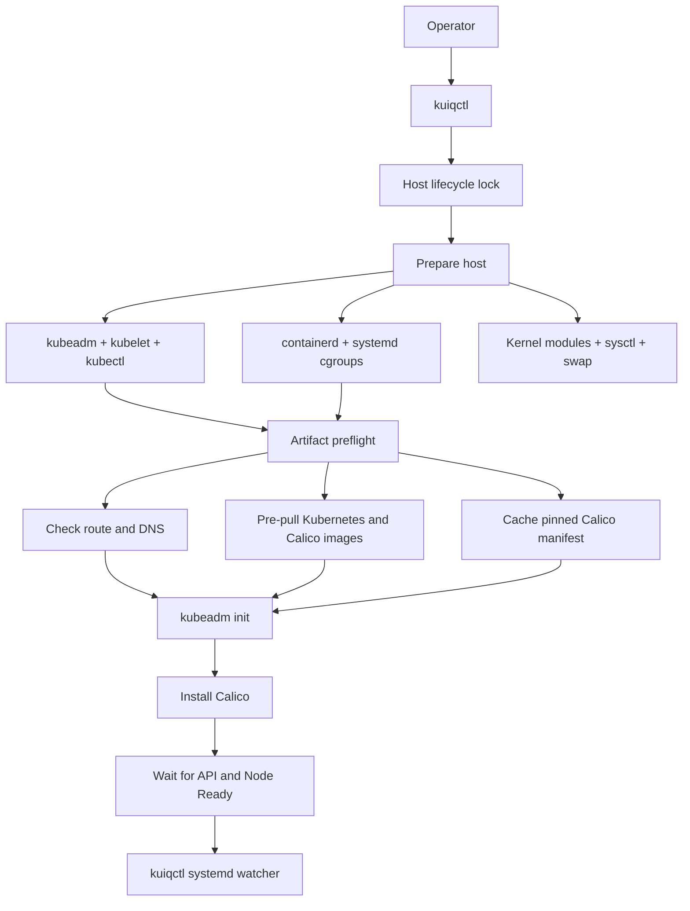
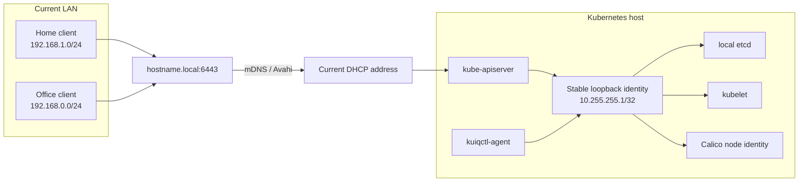

<h1 align="center">
  <picture>
    <source media="(prefers-color-scheme: dark)" srcset="assets/kuiqctl-logo-dark.svg">
    <source media="(prefers-color-scheme: light)" srcset="assets/kuiqctl-logo.svg">
    
  </picture>
</h1>

<p align="center">
  <strong>Persistent kubeadm for machines that move.</strong>
</p>

<p align="center">
  <a href="https://github.com/Zafeeruddin/kuiqctl/releases/latest"></a>
  <a href="LICENSE"></a>
  
  <a href="https://github.com/Zafeeruddin/kuiqctl/actions/workflows/ci.yml"></a>
</p>

Your kubeadm cluster should not break because you changed Wi-Fi. `kuiqctl`
creates a persistent single-node Kubernetes cluster on Debian or Ubuntu with a
stable internal node identity, so it can remain usable when the host moves
between LANs or receives a different DHCP address.

**kubeadm + containerd + Calico. No VM. No containerized Kubernetes nodes.**

> [!IMPORTANT]
> kuiqctl is an early-stage `v0.1` project. It is intended for a single Linux
> host, not a high-availability or multi-node production control plane.

## See it survive a network change

<p align="center">
  
</p>

<p align="center">
  <a href="https://github.com/Zafeeruddin/kuiqctl/releases/download/v0.1.0/kuiqctl-demo.mp4"><strong>⬇ Download the full-quality MP4</strong></a>
</p>

```text
Changing LAN IP
        ↓
hostname resolves to the current address
        ↓
Kubernetes continues using its stable internal node identity
        ↓
cluster remains Ready
```

## Quick start

```bash
git clone --branch v0.1.0 --depth 1 https://github.com/Zafeeruddin/kuiqctl.git
cd kuiqctl
sudo ./install.sh
kuiqctl --version
sudo kuiqctl create
kubectl get nodes
```

After creation, kuiqctl installs the administrator kubeconfig at
`~/.kube/config` for the user who invoked `sudo`. If that file already exists,
the new cluster is merged into it so other contexts are preserved. The
local default uses the stable loopback endpoint so host-side `kubectl` does not
depend on DNS or proxy bypass settings. The `kuiqctl kubeconfig` command remains
available for exporting a roaming-endpoint configuration to another path.

`install.sh` installs the CLI at `/usr/local/bin/kuiqctl`, configuration at
`/etc/kuiqctl/config.json`, and the network watcher as a systemd service. After
installation, `kuiqctl` can be run from any directory.

Requires a Debian or Ubuntu host using systemd, root access through `sudo`, and
an internet connection for Kubernetes packages and container images.

The tagged clone above is the simplest versioned installation. Starting with
the next release, GitHub Releases will also contain a versioned install archive
and matching `.sha256` file. Download both, verify with `sha256sum --check`,
extract the archive, and run its `install.sh`. Clone the default branch only
when testing unreleased development work.

## Why not minikube, kind, or k3s?

These projects solve different problems. kuiqctl makes sense when you
specifically want upstream kubeadm running directly on a persistent Linux host
whose LAN address can change.

| Tool | Primary use | How Kubernetes runs |
| --- | --- | --- |
| [kind](https://kind.sigs.k8s.io/) | Testing and CI | Kubernetes nodes inside containers |
| [minikube](https://minikube.sigs.k8s.io/) | Local development and learning | VM, container, or bare-metal driver |
| [k3s](https://k3s.io/) | Lightweight edge, homelab, and IoT clusters | k3s distribution |
| **kuiqctl** | Persistent Linux host that moves between networks | kubeadm directly on the host |

kuiqctl is not a general replacement for those tools. Choose it when the
combination of upstream kubeadm, host-native services, persistence, and a
changing network address is the point.

## Recreate or remove the cluster

Recreate the cluster from scratch:

```bash
sudo kuiqctl recreate --yes
```

Remove the cluster while preserving the installed packages and kuiqctl
configuration:

```bash
sudo kuiqctl remove --yes
```

Both commands permanently delete workloads, Kubernetes objects, and local
etcd data. The required `--yes` flag prevents accidental resets.

Other useful commands:

```bash
sudo kuiqctl preflight
sudo kuiqctl status
sudo kuiqctl doctor
journalctl -u kuiqctl-agent.service -f
```

### Uninstall kuiqctl

Remove the cluster first, then run the uninstall script from the same tagged
source or release archive that was used for installation:

```bash
sudo kuiqctl remove --yes
sudo ./uninstall.sh
```

The script refuses to continue while Kubernetes cluster markers remain. It
removes the kuiqctl CLI, agent unit, and kuiqctl-owned runtime files, but keeps
`/etc/kuiqctl/config.json` by default. Use `sudo ./uninstall.sh --purge-config`
to remove that file too. It does not uninstall Kubernetes packages or
containerd, restore containerd configuration, or delete unrelated CNI/runtime
state.

## Architecture

### Cluster lifecycle



For `recreate`, host and artifact preparation completes before the old cluster
is reset. DNS, routing, proxy, registry, authentication, package, or download
failures therefore stop before destructive reset.

### Roaming network design



Remote kubectl clients use the stable `<hostname>.local` TLS name, which mDNS
maps to the machine's current LAN address. Internally, kubeadm, etcd, kubelet,
and Calico use the host-only `stable_node_ip`. Moving between LANs therefore
does not leave control-plane components bound to an old DHCP address.

This follows kubeadm's
[`controlPlaneEndpoint`](https://kubernetes.io/docs/reference/config-api/kubeadm-config.v1beta4/#kubeadm-k8s-io-v1beta4-ClusterConfiguration)
model: a stable IP address or DNS name represents the control plane instead of
the host's current interface address.

Some managed, corporate, and guest networks block mDNS or isolate clients. On
those networks, configure `endpoint` as a routed DNS name, Tailscale MagicDNS
name, or another stable hostname.

## Configuration

The default configuration is installed at `/etc/kuiqctl/config.json`:

```json
{
  "cluster_name": "kuiqctl",
  "endpoint": "",
  "kubernetes_minor": "1.37",
  "calico_version": "v3.32.1",
  "image_repository": "registry.k8s.io",
  "pod_cidr": "10.244.0.0/16",
  "service_cidr": "10.96.0.0/12",
  "stable_node_ip": "10.255.255.1",
  "allowed_client_cidrs": [
    "192.168.0.0/24",
    "192.168.1.0/24"
  ],
  "network_poll_seconds": 15
}
```

An empty `endpoint` becomes `<hostname>.local`. Change the configuration before
creating the first cluster. Pod, Service, stable-node, and allowed-client
networks are checked for overlaps.

Set `image_repository` when Kubernetes control-plane images must come from a
corporate mirror. Configure containerd registry mirrors and credentials as
usual when Calico images must also be mirrored.

## What kuiqctl changes on the host

`install.sh` installs `/usr/local/bin/kuiqctl`, the
`kuiqctl-agent.service` systemd unit, and a public configuration file at
`/etc/kuiqctl/config.json`. It preserves an existing config and keeps a backup
when migrating the older project format.

During `create` or `recreate`, kuiqctl makes these host-level changes:

- Adds the Kubernetes apt signing key and minor-version repository under
  `/etc/apt/keyrings` and `/etc/apt/sources.list.d`, then installs and holds
  `kubeadm`, `kubelet`, `kubectl`, and `cri-tools` at matching versions.
- Reuses an existing containerd, including Docker's `containerd.io`, when one
  is installed. Otherwise it installs Debian/Ubuntu's `containerd` package.
  Before generating a containerd config it saves the existing config once as
  `/etc/containerd/config.toml.before-kuiqctl`, enables systemd cgroups, and
  enables/restarts containerd.
- Installs and enables `avahi-daemon` when the endpoint uses `.local`.
- Loads `overlay` and `br_netfilter`, writes
  `/etc/modules-load.d/kuiqctl.conf` and `/etc/sysctl.d/99-kuiqctl.conf`, and
  enables bridge filtering and IPv4 forwarding.
- Disables active swap. It does not edit `/etc/fstab`; the network watcher
  keeps swap disabled while installed and running.
- Adds `stable_node_ip/32` to loopback and enables the
  `kuiqctl-agent.service` watcher so the address survives service restarts and
  the current LAN address can change.
- Writes generated kubeadm input to `/etc/kubernetes/kuiqctl-kubeadm.yaml`.
  kubeadm then owns its normal state under `/etc/kubernetes`, `/var/lib/etcd`,
  and `/var/lib/kubelet`.
- Installs or merges the cluster credentials into `~/.kube/config` for the
  user who invoked `sudo`, with user ownership and restrictive permissions.
- Caches the pinned Calico manifest at `/var/cache/kuiqctl/calico.yaml` and
  installs Calico's normal Kubernetes and CNI state.
- When UFW is active, adds TCP/6443 allow rules for each configured
  `allowed_client_cidrs` entry. It does not enable UFW.
- Uses `/run/kuiqctl/primary-ip` for watcher state and
  `/run/lock/kuiqctl.lock` to serialize lifecycle operations.

`kuiqctl remove --yes` resets kubeadm/etcd state, removes the Calico files and
interfaces it manages, removes the stable loopback address, and disables the
kubelet and watcher. It deliberately preserves installed packages and holds,
the Kubernetes apt repository/key, containerd and its config/backup, Avahi,
UFW rules, kuiqctl's CLI/service/config, cached manifest, and host module/sysctl
files. This makes recreation and inspection possible without silently undoing
shared host configuration.

## Creation and safety workflow

Before `kubeadm init`, kuiqctl:

1. Acquires a host-visible lock to reject concurrent lifecycle operations.
2. Rejects existing or partial cluster state during `create`.
3. Installs matching kubeadm, kubelet, kubectl, and cri-tools packages.
4. Reuses Docker's `containerd.io` when present instead of installing the
   conflicting Ubuntu `containerd` package.
5. Configures containerd, kernel modules, forwarding, and swap.
6. Uses the exact installed Kubernetes patch version.
7. Checks the default IPv4 route and required DNS names.
8. Caches the Calico manifest and pre-pulls all required images.
9. Validates the generated kubeadm v1beta4 configuration.
10. Initializes Kubernetes, installs Calico, and waits for readiness.

`create` also checks ports 6443, 10257, 10259, 2379, and 2380. Existing state or
occupied control-plane ports produce a concise message directing the operator
to `sudo kuiqctl recreate --yes`.

During `recreate`, kuiqctl stops kubelet, resets every detected CRI socket
(including older CRI-O installations), force-removes any CRI workloads that
survive kubeadm's best-effort reset, and terminates verified stale Kubernetes
components still holding their reserved ports. It removes owned CNI state and
waits for all control-plane ports to close before initializing the replacement
cluster. Processes that do not match the expected Kubernetes component are
never killed automatically.
The destructive confirmation flag is accepted on either side of the command:
`sudo kuiqctl recreate --yes` and `sudo kuiqctl --yes recreate` are equivalent.

## Troubleshooting

Use `preflight` before creating a cluster; it intentionally rejects existing
Kubernetes state. Use `doctor` to troubleshoot a cluster that is already
created:

```bash
sudo kuiqctl preflight
sudo kuiqctl status
sudo kuiqctl doctor
```

`doctor` checks the configuration, services, loopback identity, current LAN
address, roaming endpoint and mDNS, API readiness, node readiness/InternalIP,
and Calico health. Important failures return a non-zero status and include a
suggested next command. An unavailable `.local` resolution path is reported as
a warning because some networks intentionally block mDNS.

For network or registry failures:

```bash
ip -4 route
resolvectl status
resolvectl query registry.k8s.io
```

For occupied ports or stale control-plane processes:

```bash
sudo ss -ltnp
sudo journalctl -u kubelet -u containerd -n 200
sudo crictl --runtime-endpoint unix:///run/containerd/containerd.sock ps -a
```

Artifact failures are reported before cluster reset and classified as DNS,
routing, timeout, proxy/firewall, authentication, or registry failures.

## Current limitations

- Single-node only; this is not a high-availability control plane.
- IPv4 only.
- Debian/Ubuntu hosts using systemd are currently supported.
- `.local` endpoints depend on mDNS being available on the client network.
- Remote workers require a routed stable control-plane endpoint and network
  design; the local loopback identity alone is not reachable from another host.

## Implementation

The orchestration workflow is implemented in the repository's `kuiqctl` Python
executable and does not depend on Ansible:

- `prepare_host()` installs and configures host dependencies.
- `write_kubeadm_config()` generates kubeadm v1beta4 configuration.
- `prepare_creation_artifacts()` validates and caches external dependencies.
- `initialize_cluster()` runs kubeadm, installs Calico, and verifies readiness.
- `reset_cluster()` removes kubeadm and kuiqctl-owned CNI state.
- `create()` and `recreate()` enforce the safe lifecycle ordering.

This is a quick single-host cluster, not a high-availability control plane. A
host failure stops the cluster.
