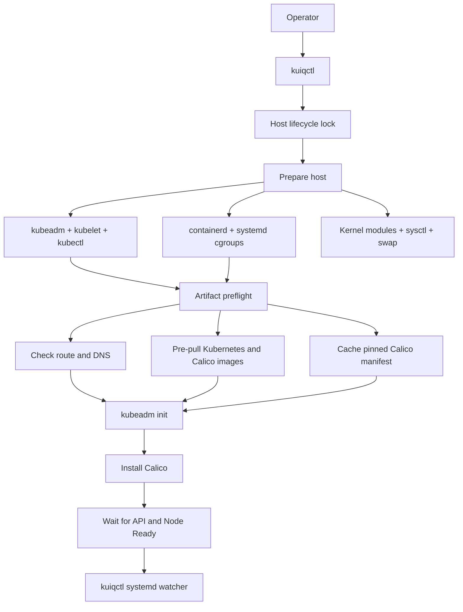
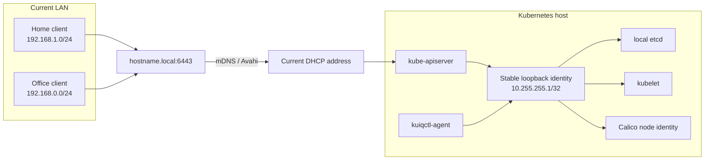

# kuiqctl

Create, recreate, inspect, and remove a persistent single-node Kubernetes
cluster with a few commands. `kuiqctl` uses kubeadm, containerd, Calico, and
systemd on Debian/Ubuntu hosts.

## Quick start

```bash
git clone https://github.com/Zafeeruddin/kuiqctl.git
cd kuiqctl
sudo ./install.sh
kuiqctl --version
sudo kuiqctl create
```

Export the administrator kubeconfig and verify the cluster:

```bash
sudo kuiqctl kubeconfig --output "$HOME/.kube/kuiqctl.yaml"
export KUBECONFIG="$HOME/.kube/kuiqctl.yaml"
kubectl get nodes
```

`install.sh` installs the CLI at `/usr/local/bin/kuiqctl`, configuration at
`/etc/kuiqctl/config.json`, and the network watcher as a systemd service. After
installation, `kuiqctl` can be run from any directory.

Requires a Debian or Ubuntu host using systemd, root access through `sudo`, and
an internet connection for Kubernetes packages and container images.

## Recreate or remove the cluster

Recreate the cluster from scratch:

```bash
sudo kuiqctl recreate --yes
```

Remove the cluster while preserving the installed packages and kuiqctl
configuration:

```bash
sudo kuiqctl remove --yes
```

Both commands permanently delete workloads, Kubernetes objects, and local
etcd data. The required `--yes` flag prevents accidental resets.

Other useful commands:

```bash
sudo kuiqctl preflight
sudo kuiqctl status
journalctl -u kuiqctl-agent.service -f
```

## Architecture

### Cluster lifecycle



For `recreate`, host and artifact preparation completes before the old cluster
is reset. DNS, routing, proxy, registry, authentication, package, or download
failures therefore stop before destructive reset.

### Roaming network design



Remote kubectl clients use the stable `<hostname>.local` TLS name, which mDNS
maps to the machine's current LAN address. Internally, kubeadm, etcd, kubelet,
and Calico use the host-only `stable_node_ip`. Moving between LANs therefore
does not leave control-plane components bound to an old DHCP address.

Some managed, corporate, and guest networks block mDNS or isolate clients. On
those networks, configure `endpoint` as a routed DNS name, Tailscale MagicDNS
name, or another stable hostname.

## Configuration

The default configuration is installed at `/etc/kuiqctl/config.json`:

```json
{
  "cluster_name": "kuiqctl",
  "endpoint": "",
  "kubernetes_minor": "1.37",
  "calico_version": "v3.32.1",
  "image_repository": "registry.k8s.io",
  "pod_cidr": "10.244.0.0/16",
  "service_cidr": "10.96.0.0/12",
  "stable_node_ip": "10.255.255.1",
  "allowed_client_cidrs": [
    "192.168.0.0/24",
    "192.168.1.0/24"
  ],
  "network_poll_seconds": 15
}
```

An empty `endpoint` becomes `<hostname>.local`. Change the configuration before
creating the first cluster. Pod, Service, stable-node, and allowed-client
networks are checked for overlaps.

Set `image_repository` when Kubernetes control-plane images must come from a
corporate mirror. Configure containerd registry mirrors and credentials as
usual when Calico images must also be mirrored.

## Creation and safety workflow

Before `kubeadm init`, kuiqctl:

1. Acquires a host-visible lock to reject concurrent lifecycle operations.
2. Rejects existing or partial cluster state during `create`.
3. Installs matching kubeadm, kubelet, and kubectl packages.
4. Reuses Docker's `containerd.io` when present instead of installing the
   conflicting Ubuntu `containerd` package.
5. Configures containerd, kernel modules, forwarding, and swap.
6. Uses the exact installed Kubernetes patch version.
7. Checks the default IPv4 route and required DNS names.
8. Caches the Calico manifest and pre-pulls all required images.
9. Validates the generated kubeadm v1beta4 configuration.
10. Initializes Kubernetes, installs Calico, and waits for readiness.

`create` also checks ports 6443, 10257, 10259, 2379, and 2380. Existing state or
occupied control-plane ports produce a concise message directing the operator
to `sudo kuiqctl recreate --yes`.

During `recreate`, kuiqctl stops kubelet, resets every detected CRI socket
(including older CRI-O installations), removes owned CNI state, and waits for
old control-plane ports to close before initializing the replacement cluster.

## Troubleshooting

Run the built-in checks first:

```bash
sudo kuiqctl preflight
sudo kuiqctl status
```

For network or registry failures:

```bash
ip -4 route
resolvectl status
resolvectl query registry.k8s.io
```

For occupied ports or stale control-plane processes:

```bash
sudo ss -ltnp
sudo journalctl -u kubelet -u containerd -n 200
sudo crictl --runtime-endpoint unix:///run/containerd/containerd.sock ps -a
```

Artifact failures are reported before cluster reset and classified as DNS,
routing, timeout, proxy/firewall, authentication, or registry failures.

## Implementation

The orchestration workflow is implemented in the repository's `kuiqctl` Python
executable and does not depend on Ansible:

- `prepare_host()` installs and configures host dependencies.
- `write_kubeadm_config()` generates kubeadm v1beta4 configuration.
- `prepare_creation_artifacts()` validates and caches external dependencies.
- `initialize_cluster()` runs kubeadm, installs Calico, and verifies readiness.
- `reset_cluster()` removes kubeadm and kuiqctl-owned CNI state.
- `create()` and `recreate()` enforce the safe lifecycle ordering.

This is a quick single-host cluster, not a high-availability control plane. A
host failure stops the cluster, and adding remote worker nodes requires a
routed stable control-plane design.
